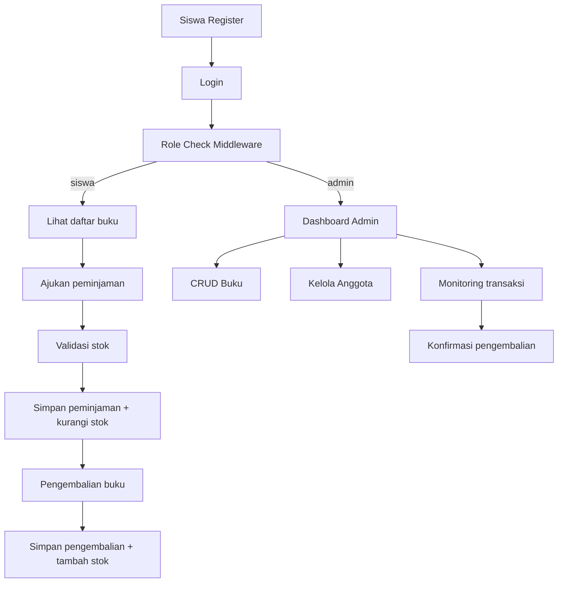

# Libros - Perpustakaan Digital UKK Paket 4 (2025/2026)

Project ini disusun untuk latihan pengembangan perangkat lunak berbasis Laravel + MySQL (Laragon) dengan dua role utama: `admin` dan `siswa`.

## 1. Stack dan Setup Laragon

1. Pastikan service Laragon aktif: Apache + MySQL.
2. Konfigurasi database di `.env`:

```env
DB_CONNECTION=mysql
DB_HOST=127.0.0.1
DB_PORT=3306
DB_DATABASE=libros_ukk
DB_USERNAME=root
DB_PASSWORD=
```

3. Jalankan setup:

```bash
composer install
php artisan key:generate
php artisan migrate
php artisan db:seed
php artisan serve
```

## 2. ERD (Konseptual)

```mermaid
erDiagram
		USERS ||--o{ PEMINJAMANS : meminjam
		BOOKS ||--o{ PEMINJAMANS : dipinjam
		PEMINJAMANS ||--o| PENGEMBALIANS : dikembalikan
		USERS ||--o{ PENGEMBALIANS : memproses

		USERS {
			bigint id PK
			string name
			string email UK
			string password
			enum role "admin|siswa"
			string nis UK
			string no_telp
			text alamat
		}

		BOOKS {
			bigint id PK
			string kode_buku UK
			string judul
			string penulis
			string penerbit
			year tahun_terbit
			string isbn UK
			int stok_total
			int stok_tersedia
			string lokasi_rak
		}

		PEMINJAMANS {
			bigint id PK
			bigint user_id FK
			bigint book_id FK
			date tanggal_pinjam
			date tanggal_jatuh_tempo
			enum status "dipinjam|dikembalikan|terlambat"
			text catatan
		}

		PENGEMBALIANS {
			bigint id PK
			bigint peminjaman_id FK UK
			bigint processed_by FK
			date tanggal_kembali
			decimal denda
			text catatan_kondisi
		}
```

SQL siap import ada di `database/schema/ukk_perpustakaan.sql`.

## 3. Flowmap Sistem



## 4. Fitur Role Admin

Endpoint admin dilindungi middleware `auth` + `role:admin`.

- `GET /admin/books` daftar buku (pagination)
- `POST /admin/books` tambah buku
- `GET /admin/books/{book}` detail buku
- `PUT /admin/books/{book}` ubah buku
- `DELETE /admin/books/{book}` hapus buku (ditolak jika masih dipinjam)
- `GET /admin/members` daftar anggota siswa
- `POST /admin/members` tambah anggota
- `PUT /admin/members/{member}` ubah anggota
- `DELETE /admin/members/{member}` hapus anggota
- `GET /admin/transactions` monitoring transaksi
- `POST /admin/transactions/loan` catat peminjaman manual
- `POST /admin/transactions/{peminjaman}/return` konfirmasi pengembalian

UI admin profesional (Blade + Tailwind) tersedia di:

- `resources/views/admin/dashboard.blade.php`
- `resources/views/admin/books/*`
- `resources/views/admin/members/*`
- `resources/views/admin/transactions/index.blade.php`

## 5. Fitur Role Siswa

Endpoint siswa dilindungi middleware `auth` + `role:siswa`.

- `POST /register` registrasi akun siswa
- `POST /login` login
- `POST /logout` logout
- `GET /siswa/loans` riwayat peminjaman pribadi
- `POST /siswa/loans` ajukan peminjaman (maks 3 buku aktif)
- `POST /siswa/loans/{peminjaman}/return` pengembalian buku sendiri

UI siswa tersedia di:

- `resources/views/siswa/dashboard.blade.php`
- `resources/views/siswa/loans/index.blade.php`

## 6. Validasi dan Keamanan

- Validasi request dipisahkan ke Form Request:
	- `app/Http/Requests/Auth/*`
	- `app/Http/Requests/Admin/*`
	- `app/Http/Requests/Siswa/*`
- Password di-hash menggunakan `Hash::make`.
- Akses role menggunakan middleware `RoleMiddleware`.
- Operasi stok buku dan transaksi pinjam-kembali memakai `DB::transaction()` + `lockForUpdate()` untuk mencegah race condition.
- Session login diregenerasi setelah autentikasi (`session fixation protection`).
- Denda otomatis: jika tanggal kembali melewati jatuh tempo, sistem menghitung denda default `Rp1.000 x jumlah_hari_terlambat`.

## 7. Contoh Dokumentasi Fungsi (Standar Penilaian)

Contoh dokumentasi method pada controller:

```php
/**
 * Memproses pengembalian buku oleh admin.
 *
 * Alur:
 * 1) Validasi bahwa transaksi masih berstatus dipinjam.
 * 2) Simpan data pengembalian.
 * 3) Update status peminjaman.
 * 4) Tambahkan stok buku.
 *
 * @param StoreReturnRequest $request Data tanggal kembali, denda, dan catatan kondisi.
 * @param Peminjaman $peminjaman Entitas peminjaman dari route model binding.
 * @return JsonResponse
 */
```

## 8. Debugging yang Benar

1. Reproduksi bug dengan langkah yang konsisten (catat endpoint, payload, role user).
2. Cek log Laravel:

```bash
tail -f storage/logs/laravel.log
```

3. Gunakan validasi terstruktur di Form Request (hindari validasi acak di banyak tempat).
4. Gunakan `dd()` hanya saat lokal dan hapus sebelum commit.
5. Gunakan query log saat perlu:

```php
DB::listen(function ($query) {
		logger()->debug('SQL', ['sql' => $query->sql, 'bindings' => $query->bindings]);
});
```

6. Verifikasi hasil dengan:

```bash
php artisan route:list
php artisan test
```

## 10. Pengujian Fitur UKK

Skenario inti sudah otomatis diuji pada `tests/Feature/LibraryFlowTest.php`:

- Siswa tidak bisa mengakses menu admin (validasi middleware role).
- Admin bisa menambah buku (validasi CRUD inti).
- Siswa pinjam dan mengembalikan terlambat (status `terlambat` + denda otomatis).

Menjalankan test:

```bash
php artisan test
```

## 9. Struktur File Penting

- `app/Http/Controllers/Admin/*`
- `app/Http/Controllers/Siswa/LoanController.php`
- `app/Http/Controllers/AuthController.php`
- `app/Http/Middleware/RoleMiddleware.php`
- `app/Models/{User,Book,Peminjaman,Pengembalian}.php`
- `database/migrations/*`
- `database/schema/ukk_perpustakaan.sql`
- `routes/web.php`
